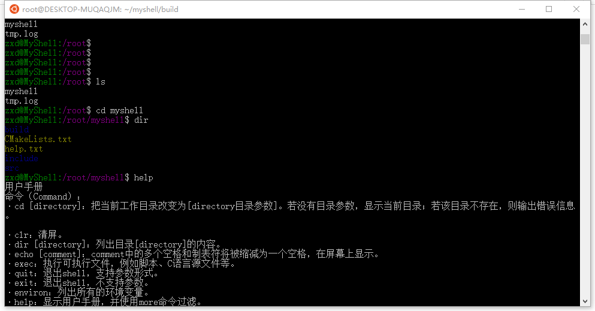
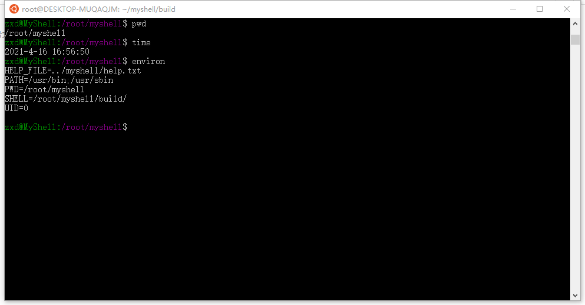
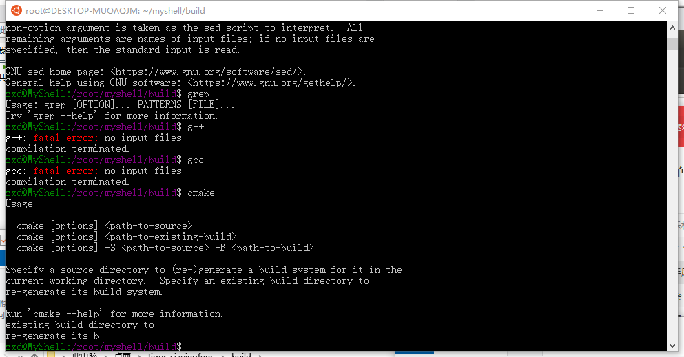

# Myshell
A simple shell within linux, maintainning environment variables and implement basic tools such as cd,help

### User Manual
Command:
* **·cd** [directory]: 
  Change the current working directory to [directory directory parameter]. If there is no directory parameter, the current directory is displayed; if the directory does not exist, an error message is output.
*  **·clr**: Clear the screen.
*  **·dir** [directory]: List the contents of the directory [directory].
*  **·echo** [comment]: Multiple spaces and tabs in the comment will be reduced to one space and displayed on the screen.
* **·exec**: execute executable files, such as scripts, C language source files, etc.
* **·quit**: Quit the shell, support parameter form.
* **·exit**: Exit the shell, no parameters are supported.
* **·environ**: List all environment variables.
* **·help**: Display the user manual, and use the more command to filter.
* **·pwd**: Display the current path.
* **·time**: Display the current time.
* **·shift**: todo..

I/O redirection
pipeline
Program environment
Background program execution

it also support executable application in /user/bin 
